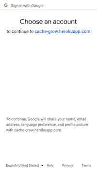
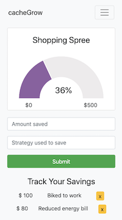

## **cacheGrow**

A financial tool that encourages less spending. 

## **Technology Used**

MongoDB, Mongoose, Express, Node.js and JavaScript 

## **Getting started**

https://cache-grow.herokuapp.com

### **Getting started**

### Users log in with Google OAuth

### Users create savings goals on their profile page

### Within their profile page, users can add savings to their goals 

## **Future Enhancements**

### Allow users to sign up as groups and save together